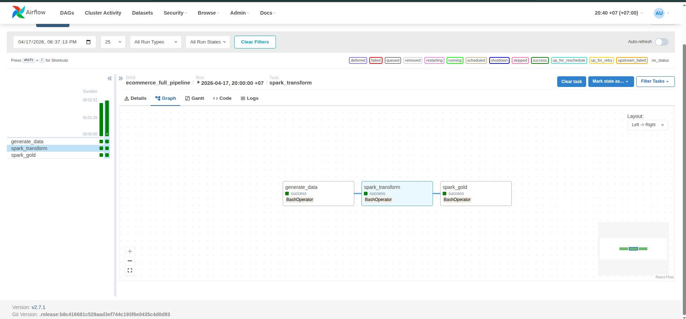
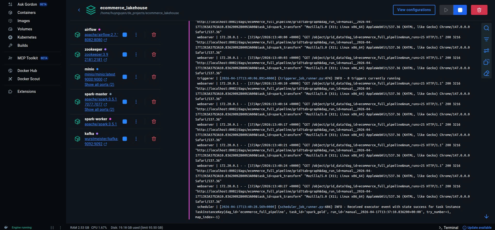
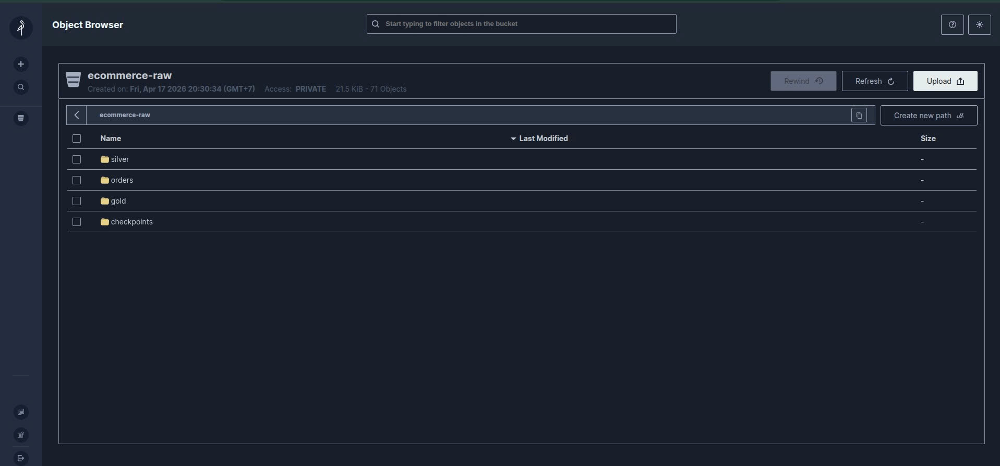

# Real-time E-commerce Data Lakehouse Pipeline

Dự án xây dựng hệ thống xử lý dữ liệu thời gian thực (End-to-End) theo kiến trúc Medallion Architecture. Hệ thống giải quyết bài toán luồng dữ liệu lớn (Big Data) từ việc mô phỏng giao dịch đến việc lưu trữ tối ưu cho phân tích.

## Kiến trúc hệ thống

1. **Data Source**: Python script sử dụng `Faker` để tạo ra hàng ngàn đơn hàng ảo.
2. **Ingestion (Bronze)**: Dữ liệu được đẩy vào **Apache Kafka** để đảm bảo khả năng mở rộng và chịu lỗi.
3. **Processing (Silver)**: **Spark Structured Streaming** tiêu thụ dữ liệu từ Kafka, làm sạch và lưu trữ dưới dạng **Parquet** vào **MinIO (S3 compatible)**.
4. **Orchestration**: Toàn bộ luồng dữ liệu được giám sát và điều phối bởi **Apache Airflow**.

## Kiến trúc dữ liệu

Hệ thống được thiết kế theo mô hình Lakehouse hiện đại, kết hợp sức mạnh của Data Lake (Lưu trữ rẻ, linh hoạt) và Data Warehouse (Quản lý schema, hiệu năng cao):

* **Bronze Layer (Kafka)**: Đóng vai trò là "Message Bus". Dữ liệu thô từ các microservices được đẩy vào Kafka Topic. Đây là điểm đệm (buffer) giúp hệ thống không bị "ngộp" khi lượng đơn hàng tăng đột biến.

* **Silver Layer (MinIO - Parquet)**: Spark Structured Streaming thực hiện chuyển đổi dữ liệu từ JSON sang Parquet. Tại đây, dữ liệu được chuẩn hóa schema, ép kiểu dữ liệu và lưu trữ dạng cột (Columnar Storage) giúp tăng tốc độ truy vấn gấp 10 lần so với JSON truyền thống.

* **Gold Layer (Analytics)**: Tầng dữ liệu cuối cùng phục vụ Business Intelligence. Dữ liệu được tổng hợp theo các chiều (Dimensions) như Doanh thu theo sản phẩm, theo thời gian.

## Tech Stack
* **Language**: Python (PySpark)
* **Processing**: Apache Spark
* **Message Broker**: Apache Kafka
* **Storage**: MinIO (Object Storage)
* **Orchestration**: Apache Airflow
* **Infrastructure**: Docker & Docker Compose

## Key Features

1. **Xử lý Docker Socket trên Linux**: Giải quyết vấn đề bảo mật và kết nối giữa Docker Desktop VM và Host Ubuntu thông qua việc cấu hình Symlink (/var/run/docker.sock) và phân quyền chmod 666.

2. **Tối ưu hóa Spark Ivy Cache**: Xử lý lỗi FileNotFoundException khi Spark tải thư viện Maven bằng cách điều hướng ivy.home sang /tmp, khắc phục triệt để vấn đề Permission trong container.

3. **Fault Tolerance (Khả năng chịu lỗi)**: Triển khai cơ chế Checkpointing trong Spark Streaming. Điều này đảm bảo nếu hệ thống gặp sự cố, Spark có thể tiếp tục xử lý từ vị trí cuối cùng trong Kafka mà không gây mất mát hay trùng lặp dữ liệu (Exactly-once semantics).

4. **S3-Compatible Storage Integration**: Cấu hình thành công giao thức s3a để Spark giao tiếp mượt mà với MinIO, tạo nền tảng cho việc triển khai trên AWS S3 thật sau này.

## Hướng dẫn khởi chạy
1. Khởi động Docker Desktop và các container:
   ```bash
   docker compose up -d
   ```
2. Cấp quyền cho Docker socket:
   ```bash
   sudo ln -sf /home/huynguyen/.docker/desktop/docker.sock /var/run/docker.sock
   sudo chmod 666 /var/run/docker.sock
    ```
3. Cài đặt môi trường Runtime cho Airflow: Do container được làm mới, cần nạp lại các thư viện Python cần thiết
   ```bash
   docker exec -u airflow ecommerce-airflow python3 -m pip install kafka-python boto3 faker
   ```
4. Khởi chạy luồng Streaming:

* Terminal 1: Chạy Spark Streaming để hứng dữ liệu.
  ```bash
  docker exec -it ecommerce-spark-master /opt/spark/bin/spark-submit \
    --master spark://spark-master:7077 \
    --conf "spark.driver.extraJavaOptions=-Divy.home=/tmp" \
    --conf "spark.executor.extraJavaOptions=-Divy.home=/tmp" \
    --packages org.apache.spark:spark-sql-kafka-0-10_2.12:3.5.1,org.apache.hadoop:hadoop-aws:3.3.4 \
    /opt/spark/scripts/spark_streaming.py
  ```
* Terminal 2: Chạy Python Producer để bắn đơn hàng.
  ```bash
  docker exec -it ecommerce-airflow python3 /opt/airflow/scripts/gen_orders_streaming.py
  ```
## Kết quả đạt được
* Xử lý dữ liệu với độ trễ thấp (Real-time).
* Lưu trữ dữ liệu tối ưu với định dạng Parquet.
* Hệ thống có khả năng tự phục hồi nhờ Checkpointing.

## Định hướng mở rộng
* Tích hợp Delta Lake để hỗ trợ ACID Transactions (Update/Delete dữ liệu trong Lakehouse).
* Xây dựng Dashboard Real-time bằng Streamlit hoặc Grafana.
* Triển khai giám sát (Monitoring) sức khỏe các node Kafka và Spark bằng Prometheus.





